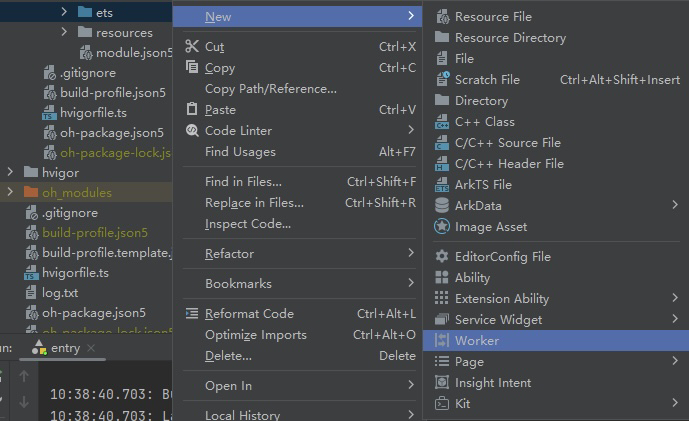
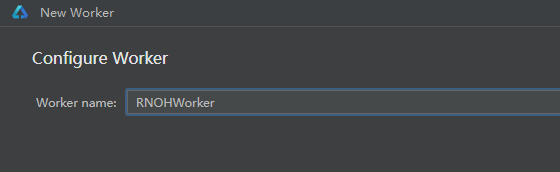

> Template version: v0.3.0

<p align="center">
  <h1 align="center"> <code>react-native-background-timer</code> </h1>
</p>

> [!TIP] [GitHub address](https://github.com/react-native-oh-library/react-native-background-timer)

## 1. Installation and Usage

Please refer to the Releases page of the third-party library for the corresponding version information

| Third-party Library Version | Release Information       | Supported RN Version |
| ---------- | ------------------------------------------------------------ | ---------- |
| <= 2.4.1-0.0.2@deprecated | [@react-native-oh-tpl/react-native-background-timer Releases(deprecated)](https://github.com/react-native-oh-library/react-native-background-timer/releases) | 0.72       |
| 2.4.2 | [@react-native-ohos/react-native-background-timer Releases](https://gitcode.com/openharmony-sig/rntpc_react-native-background-timer/releases) | 0.72       |
| 2.5.0 | [@react-native-ohos/react-native-background-timer Releases](https://gitcode.com/openharmony-sig/rntpc_react-native-background-timer/releases) | 0.77       |

For older versions not published on npm, please refer to the [Installation Guide](/en/tgz-usage-en.md) to install the tgz package.

Go to the project directory and execute the following instruction:

<!-- tabs:start -->

#### **npm**

```bash
npm install @react-native-ohos/react-native-background-timer
```

#### **yarn**

```bash
yarn add @react-native-ohos/react-native-background-timer
```

<!-- tabs:end -->

The following code shows the basic use scenario of the repository:

> [!WARNING] The name of the imported repository remains unchanged.

```js
import {View, Button, StyleSheet, Text,TextInput} from 'react-native';
import React, {useState} from 'react';
import BackgroundTimer from "react-native-background-timer";
export function BackgroundTimerExample() {
  let [count, setCount] = useState(0);
  let [text, setText] = useState("");
  let [delay, setDelay] = useState("1000");
  let [timeoutDelay, setTimeoutDelay] = useState("1000");
  let [intervalDelay, setIntervalDelay] = useState("1000");
  let timeoutList:number[] = []
  let [intervalList, setIntervalList] = useState<number[]>([]);

  // runBackgroundTimer
  function onPressStart(){
    setText("Turn on the timer...")
    BackgroundTimer.runBackgroundTimer(()=>{
      setCount(count+=1)
    },parseInt(delay))
  }
  function onPressStop(){
    setText("Turn off the timer")
    BackgroundTimer.stopBackgroundTimer()
  }

  // setTimeout
  function setTimeoutStart(){
    setText("Turn on the timer...")
    let timeoutId = BackgroundTimer.setTimeout(()=>{
      setCount(count+=1)
    },parseInt(timeoutDelay))
    timeoutList.push(timeoutId)
  }
  function setTimeoutStop(){
    setText("Turn off the timer")
    if(timeoutList.length>0){
      BackgroundTimer.clearTimeout(timeoutList[0])
      timeoutList.shift()
    }
  }

  // setInterval
  function setIntervalStart(){
    setText("Turn on the timer...")
    let intervalId = BackgroundTimer.setInterval(()=>{
      setCount(count+=1)
    },parseInt(intervalDelay))
    setIntervalList([...intervalList,intervalId])
  }
  function setIntervalStop(){
    setText("Turn off the timer")
    if(intervalList.length>0){
      BackgroundTimer.clearInterval(intervalList[0])
      intervalList.shift()
    }
  }
  function resetNumber(){
    setCount(0)
    setText("")
  }
  return (
    <View style={{flexDirection: 'column', flex: 1,backgroundColor:'white'}}>
      <View style={styles.container}>
        <View style={styles.viewStyle}>
          <Button
            onPress={onPressStart}
            title="runBackgroundTimer"
          />
          <TextInput
            style={{ height: 40, borderColor: 'gray', borderWidth: 1 }}
            placeholder="BackgroundTimer delay"
            onChangeText={(value)=>{setDelay(value)}}
            value={delay}
          />
        </View>
        <View style={[styles.viewStyle]}>
          <Button
            onPress={onPressStop}
            title="stopBackgroundTimer"
          />
        </View>
      </View>

      <View style={styles.container}>
        <View style={styles.viewStyle}>
          <Button
            onPress={setTimeoutStart}
            title="setTimeout"
          />
          <TextInput
            style={{ height: 40, borderColor: 'gray', borderWidth: 1 }}
            placeholder="setTimeout delay"
            onChangeText={(value)=>{setTimeoutDelay(value)}}
            value={timeoutDelay}
          />
        </View>
        <View style={[styles.viewStyle]}>
          <Button
            onPress={setTimeoutStop}
            title="clearTimeout"
          />
        </View>
      </View>

      <View style={styles.container}>
        <View style={styles.viewStyle}>
          <Button
            onPress={setIntervalStart}
            title="setInterval"
          />
          <TextInput
            style={{ height: 40, borderColor: 'gray', borderWidth: 1 }}
            placeholder="setInterval delay"
            onChangeText={(value)=>{setIntervalDelay(value)}}
            value={intervalDelay}
          />
        </View>
        <View style={[styles.viewStyle]}>
          <Button
            onPress={setIntervalStop}
            title="clearInterval"
          />
        </View>
      </View>

      <View style={[styles.viewStyle,styles.resetStyle]}>
        <Button
          onPress={resetNumber}
          title="Reset"
        />
      </View>
      <Text style={styles.textStyle}>{count}</Text>
      <Text style={styles.textStyle}>{text}</Text>
    </View>
  );
}

const styles = StyleSheet.create({
  container: {
    borderColor: 'black',
    borderTopWidth: 0,
    borderBottomWidth: 5,
    borderLeftWidth: 0,
    borderRightWidth: 0,
    padding: 10,
  },
  resetStyle: {
    paddingTop: 10,
  },
  viewStyle:{
    marginBottom: 10,
  },
  textStyle: {
    fontSize: 30,
  },
});


```

## 2. Link

|                                      | Is supported autolink  | Supported RN Version |
|--------------------------------------|-----------------------|----------------------|
| ~2.5.0                               |  No                   |  0.77                |
| ~2.4.2                               |  Yes                  |  0.72                |
| <= 2.4.1-0.0.2@deprecated            |  No                   |  0.72                |

Using AutoLink need to be configured according to this document, Autolink Framework Guide Documentation: https://gitcode.com/openharmony-sig/ohos_react_native/blob/master/docs/zh-cn/Autolinking.md

If the version you use supports Autolink and the project has been connected to Autolink, skip the ManualLink configuration.
<details>
  <summary>ManualLink: this step is a guide to manually configure native dependencies.</summary>

First, use DevEco Studio to open the HarmonyOS project `harmony` in the project directory.

### 2.1 Overrides RN SDK

To ensure the project relies on the same version of the RN SDK, you need to add an `overrides` field in the project's root `oh-package.json5` file, specifying the RN SDK version to be used. The replacement version can be a specific version number, a semver range, or a locally available HAR package or source directory.

For more information about the purpose of this field, please refer to the [official documentation](https://developer.huawei.com/consumer/en/doc/harmonyos-guides-V5/ide-oh-package-json5-V5#en-us_topic_0000001792256137_overrides).

```json
{
  "overrides": {
    "@rnoh/react-native-openharmony": "^0.77.17" // ohpm version
    // "@rnoh/react-native-openharmony" : "./react_native_openharmony.har" // a locally available HAR package
    // "@rnoh/react-native-openharmony" : "./react_native_openharmony" // source code directory
  }
}
```

### 2.2 Introducing Native Code

Currently, two methods are available:

- Use the HAR file.
- Directly link to the source code。

Method 1 (recommended): Use the HAR file.

> [!TIP] The HAR file is stored in the `harmony` directory in the installation path of the third-party library.

Open `entry/oh-package.json5` file and add the following dependencies:

```json
"dependencies": {
    "@react-native-ohos/react-native-background-timer": "file:../../node_modules/@react-native-ohos/react-native-background-timer/harmony/background_timer.har"
  }
```

Click the `sync` button in the upper right corner.

Alternatively, run the following instruction on the terminal:

```bash
cd entry
ohpm install
```

Method 2: Directly link to the source code.

**For details, see [Directly Linking Source Code](/en/link-source-code.md).**

### 2.3 Configuring CMakeLists and Introducing BackgroundTimerPackage

> If you are using version <= 2.4.1-0.0.2, please skip this chapter.

Open `entry/src/main/cpp/CMakeLists.txt` and add the following code:

```diff
+ set(OH_MODULES "${CMAKE_CURRENT_SOURCE_DIR}/../../../oh_modules")

# RNOH_BEGIN: manual_package_linking_1
+ add_subdirectory("${OH_MODULES}/@react-native-ohos/react-native-background-timer/src/main/cpp" ./background_timer)
# RNOH_END: manual_package_linking_1

# RNOH_BEGIN: manual_package_linking_2
+ target_link_libraries(rnoh_app PUBLIC rnoh_background_timer)
# RNOH_END: manual_package_linking_2
```

Open `entry/src/main/cpp/PackageProvider.cpp` and add the following code:

```diff
#include "RNOH/PackageProvider.h"
#include "generated/RNOHGeneratedPackage.h"
+ #include "BackgroundTimerPackage.h"

using namespace rnoh;

std::vector<std::shared_ptr<Package>> PackageProvider::getPackages(Package::Context ctx) {
    return {
        std::make_shared<RNOHGeneratedPackage>(ctx),
+       std::make_shared<BackgroundTimerPackage>(ctx),
    };
}
```

### 2.4. Introducing BackgroundTimerPackage to ArkTS

Open the `entry/src/main/ets/RNPackagesFactory.ts` file and add the following code:

```diff
  ...
+ import { BackgroundTimerTurboModulePackage } from '@react-native-ohos/react-native-background-timer/ts';

export function createRNPackages(ctx: RNPackageContext): RNPackage[] {
  return [
+   new BackgroundTimerTurboModulePackage(ctx)
  ];
}
```

</details>

## 3.Necessary configuration items

> [!TIP] The content of this module cannot be automatically generated by autolink and must always be manually configured.

### Configure TurboModule to run on worker thread(This module always requires manual configuration)

Open the `entry/src/main/ets/entryability/EntryAbility.ets`file and add the following code:

```diff
import {RNAbility} from '@rnoh/react-native-openharmony';

export default class EntryAbility extends RNAbility {
+  override getRNOHWorkerScriptUrl() {
+    return "entry/ets/workers/RNOHWorker.ets"
+  }
...
}
```

Right click on the ETS path and select the `New` option. Expand the menu on the right and choose the `Woker` option:

    
  After selection, name `RNOHWorker. ets` in the pop-up window:

     
  At this point, the directory structure is:
   ```
   └── ets
       ├── entryability
       ├── page
       └── workers
           └── RNOHWorker.ets         
   ```

   Modify `RNOHWorker. ets` to the following code:
   ```typescript
   // entry/src/main/ets/worker/RNOHWorker.ets
   import { setupRNOHWorker } from "@rnoh/react-native-openharmony/src/main/ets/setupRNOHWorker";
   import { createRNPackages } from '../RNPackagesFactory';

   setupRNOHWorker({
     createWorkerRNInstanceConfig: (_rnInstanceName) => {
       return { thirdPartyPackagesFactory: createRNPackages }
     }
   })
   ```

## 4. Running

Click the `sync` button in the upper right corner.

Alternatively, run the following instruction on the terminal:

```bash
cd entry
ohpm install
```

Then build and run the code.

## 5. Constraints

### 5.1 Compatibility

To use this repository, you need to use the correct React-Native and RNOH versions. In addition, you need to use DevEco Studio and the ROM on your phone.

Verified in the following versions.

1. RNOH: 0.72.96; SDK: HarmonyOS 6.0.0 Release SDK; IDE: DevEco Studio 6.0.0.858; ROM: 6.0.0.112;
2. RNOH: 0.72.33; SDK: HarmonyOS NEXT B1; IDE: DevEco Studio: 5.0.3.900; ROM: Next.0.0.71;
3. RNOH: 0.77.18; SDK: HarmonyOS 6.0.0 Release SDK; IDE: DevEco Studio 6.0.0.858; ROM: 6.0.0.112;

## 6. APIs

> [!TIP] The **Platform** column indicates the platform where the properties are supported in the original third-party library.

> [!TIP] If the value of **HarmonyOS Support** is **yes**, it means that the HarmonyOS platform supports this property; **no** means the opposite; **partially** means some capabilities of this property are supported. The usage method is the same on different platforms and the effect is the same as that of iOS or Android.

| Name                | Description                                                                    | Required | Platform | HarmonyOS Support |
| ------------------- | ------------------------------------------------------------------------------ | -------- | -------- | ----------------- |
| runBackgroundTimer  | Starts a timer to repeatedly execute specified code at a fixed interval.       | no       | all      | yes               |
| stopBackgroundTimer | Stops the timer started by **runBackgroundTimer**.                             | no       | all      | yes               |
| start               | Starts a new task in the background.                                           | no       | all      | no                |
| stop                | Stops a background task.                                                       | no       | all      | no                |
| setTimeout          | Starts a timer to execute the specified code only once when the timer expires. | no       | Android  | yes               |
| clearTimeout        | Stops the timer started by **setTimeout**.                                     | no       | Android  | yes               |
| setInterval         | Starts a timer to repeatedly execute specified code at a fixed interval.       | no       | Android  | yes               |
| clearInterval       | Stops the timer started by **setInterval**.                                    | no       | Android  | yes               |

## 7. Known Issues

- [ ] The underlying OS does not support RNOHContext serialized transfer in the new thread created by Worker. As a result, events cannot be sent in the new thread. The underlying OS framework needs to implement related service functionality. If no thread is started, the timer is not affected because **setTimeout** is an asynchronous method. The **start** and **stop** APIs of the Worker thread are not supported in HarmonyOS RN: [issue](https://gitcode.com/openharmony-sig/rntpc_react-native-background-timer/issues/2).

## 8. Others

## 9. License

This project is licensed under (https://GitCode.com/openharmony-sig/rntpc_react-native-background-timer/blob/master/LICENSE).
