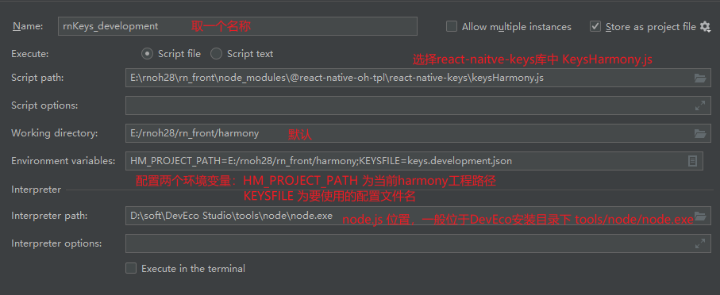
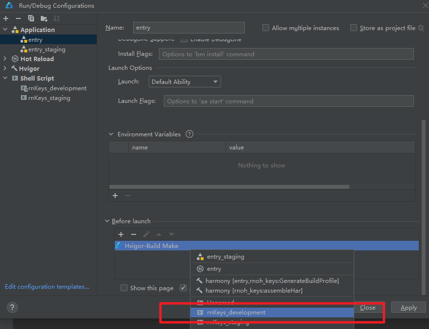

> Template version: v0.2.2

<p align="center">
  <h1 align="center"> <code>react-native-keys</code> </h1>
</p>
<p align="center">
    <a href="https://github.com/numandev1/react-native-keys">
        
    </a>
    <a href="https://github.com/numandev1/react-native-keys/blob/main/LICENSE">
        
    </a>
</p>

> [!TIP] [GitHub address](https://github.com/react-native-oh-library/react-native-keys)

## Installation and Usage

Please refer to the Releases page of the third-party library for the corresponding version information

| Third-party Library Version | Release Information       | Supported RN Version |
| ---------- | ------------------------------------------------------------ | ---------- |
| 0.7.11@deprecated  | [@react-native-oh-tpl/react-native-keys Releases(deprecated)](https://github.com/react-native-oh-library/react-native-keys/releases) | 0.72       |
| 0.7.12             | [@react-native-ohos/react-native-keys Releases](https://gitcode.com/openharmony-sig/rntpc_react-native-keys/releases)   | 0.72       |
| 0.8.0              | [@react-native-ohos/react-native-keys Releases](https://gitcode.com/openharmony-sig/rntpc_react-native-keys/releases)   | 0.77       |

For older versions not published on npm, please refer to the [Installation Guide](/zh-cn/tgz-usage.md) to install the tgz package.

Go to the project directory and execute the following instruction:


<!-- tabs:start -->

#### npm

```bash
npm install @react-native-ohos/react-native-keys
```

#### yarn

```bash
yarn add @react-native-ohos/react-native-keys
```

<!-- tabs:end -->

The following code shows the basic use scenario of the repository:

> [!WARNING] The name of the imported repository remains unchanged.

1. Create a new file keys.development.json in the root of your React Native app and add Envs in secure object for protected envs variables and add Envs in public for public usage this:

```json
{
  "secure": {
    "GOOGLE_API": "ABCD",
    "BRANCH_API": "ABCDEF"
  },
  "public": {
    "APP_NAME": "Keys Example",
    "BUNDLE_ID": "com.example.rnkeys.dev",
    "ANDROID_CODE": "50",
    "PACKAGE_ID": "com.example.rnkeys.dev"
  }
}
```

2. Use Public Keys & Secure Keys

```js
import Keys from "react-native-keys";

Keys.API_URL;
Keys.URI_SCHEME;

Keys.secureFor("API_TOKEN");
Keys.secureFor("GOOGLE_API_KEY");
Keys.secureFor("SECRET_KEY");
```

## Link

Version >= @react-native-ohos/react-native-keys@0.7.12 now supports Autolink without requiring manual configuration, currently only supports 72 frameworks.
Autolink Framework Guide Documentation: https://gitcode.com/openharmony-sig/ohos_react_native/blob/master/docs/zh-cn/Autolinking.md

This step provides guidance for manually configuring native dependencies.

Open the `harmony` directory of the HarmonyOS project in DevEco Studio.

### 1. Adding the overrides Field to oh-package.json5 File in the Root Directory of the Project

```json
{
  ...
  "overrides": {
    "@rnoh/react-native-openharmony" : "./react_native_openharmony"
  }
}
```

### 2. Introducing Native Code

Currently, two methods are available:

Method 1 (recommended): Use the HAR file. (Recommended)

> [!TIP] The HAR file is stored in the `harmony` directory in the installation path of the third-party library.

Open `entry/oh-package.json5` file and add the following dependencies:

```json
"dependencies": {
    "@rnoh/react-native-openharmony": "file:../react_native_openharmony",
    "@react-native-ohos/react-native-keys": "file:../../node_modules/@react-native-ohos/react-native-keys/harmony/rnoh_keys.har"
  }
```

Click the `sync` button in the upper right corner.

Alternatively, run the following instruction on the terminal:

```bash
cd entry
ohpm install
```

Method 2: Directly link to the source code.

> [!TIP] For details, see [Directly Linking Source Code](/en/link-source-code.md).

### 3. Configuring CMakeLists and Introducing RNOHKeysPackage

> V0.7.12 requires configuring CMakeLists and importing RNOHKeysPackage

Open `entry/src/main/cpp/CMakeLists.txt` and add the following code:

```diff
project(rnapp)
cmake_minimum_required(VERSION 3.4.1)
set(CMAKE_SKIP_BUILD_RPATH TRUE)
set(RNOH_APP_DIR "${CMAKE_CURRENT_SOURCE_DIR}")
set(NODE_MODULES "${CMAKE_CURRENT_SOURCE_DIR}/../../../../../node_modules")
+ set(OH_MODULES "${CMAKE_CURRENT_SOURCE_DIR}/../../../oh_modules")
set(RNOH_CPP_DIR "${CMAKE_CURRENT_SOURCE_DIR}/../../../../../../react-native-harmony/harmony/cpp")
set(LOG_VERBOSITY_LEVEL 1)
set(CMAKE_ASM_FLAGS "-Wno-error=unused-command-line-argument -Qunused-arguments")
set(CMAKE_CXX_FLAGS "-fstack-protector-strong -Wl,-z,relro,-z,now,-z,noexecstack -s -fPIE -pie")
set(WITH_HITRACE_SYSTRACE 1) # for other CMakeLists.txt files to use
add_compile_definitions(WITH_HITRACE_SYSTRACE)

add_subdirectory("${RNOH_CPP_DIR}" ./rn)

# RNOH_BEGIN: manual_package_linking_1
add_subdirectory("../../../../sample_package/src/main/cpp" ./sample-package)
+ add_subdirectory("${OH_MODULES}/@react-native-ohos/react-native-keys/src/main/cpp" ./rnohkeys)
# RNOH_END: manual_package_linking_1

file(GLOB GENERATED_CPP_FILES "./generated/*.cpp")

add_library(rnoh_app SHARED
    ${GENERATED_CPP_FILES}
    "./PackageProvider.cpp"
    "${RNOH_CPP_DIR}/RNOHAppNapiBridge.cpp"
)
target_link_libraries(rnoh_app PUBLIC rnoh)

# RNOH_BEGIN: manual_package_linking_2
target_link_libraries(rnoh_app PUBLIC rnoh_sample_package)
+ target_link_libraries(rnoh_app PUBLIC rnoh_keys)
# RNOH_END: manual_package_linking_2
```

Open `entry/src/main/cpp/PackageProvider.cpp` and add the following code:

```diff
#include "RNOH/PackageProvider.h"
#include "generated/RNOHGeneratedPackage.h"
#include "SamplePackage.h"
+ #include "RNKeysPackage.h"

using namespace rnoh;

std::vector<std::shared_ptr<Package>> PackageProvider::getPackages(Package::Context ctx) {
    return {
        std::make_shared<RNOHGeneratedPackage>(ctx),
        std::make_shared<SamplePackage>(ctx),
+       std::make_shared<RNOHKeysPackage>(ctx),
    };
}
```

### 4. Introducing RNKeysPackage to ArkTS

Open the `entry/src/main/ets/RNPackagesFactory.ts` file and add the following code:

```diff
  ...
+ import { RNKeysPackage } from '@react-native-ohos/react-native-keys';

export function createRNPackages(ctx: RNPackageContext): RNPackage[] {
  return [
    new SamplePackage(ctx),
+   new RNKeysPackage(ctx)
  ];
}
```

### 5. Creating a Pre-running Script in DevEco (Generating the Encryption/Decryption Code and Compiling Configuration Files)

> [!TIP] After the configuration is complete, click **Apply** for the configuration to take effect.

1. Click **Entry** in the upper right corner and choose **Edit Configurations** to open the configuration panel.
2. Click **+** in the upper left corner of the panel, select **Shell Script**, open the configuration panel of the new script, and configure the script as prompted. 
   
3. Choose **Entry** > **Before Lunch**, click **+**, select **Run Another Configuration**, select the **Shell Script** configured in the previous step, and drag the configuration to the upper part of **Hvigor-Build Make**. 
   

### 6. Running

Click the `sync` button in the upper right corner.

Alternatively, run the following instruction on the terminal:

```bash
cd entry
ohpm install
```

Then build and run the code.

## Constraints

### Compatibility

To use this library, you need to use the correct React-Native and RNOH versions. Additionally, you need to use the matching DevEco Studio and phone ROM.

Verified successfully in the following versions:

1. RNOH: 0.72.96; SDK: HarmonyOS 5.1.0.150 (API Version 12); IDE: DevEco Studio 5.1.1.830; ROM: 5.1.0.150;
2. RNOH: 0.72.33; SDK: HarmonyOS NEXT B1; IDE: DevEco Studio: 5.0.3.900; ROM: Next.0.0.71;
3. RNOH: 0.77.18; SDK: HarmonyOS 5.0.0.71(API Version 12 Release) ;IDE:DevEco Studio:5.1.1.830; ROM: HarmonyOS 5.1.0.150;

## API

> [!TIP] The **Platform** column indicates the platform where the properties are supported in the original third-party library.

> [!TIP] If the value of **HarmonyOS Support** is **yes**, it means that the HarmonyOS platform supports this property; **no** means the opposite; **partially** means some capabilities of this property are supported. The usage method is the same on different platforms and the effect is the same as that of iOS or Android.

| Name            | Description          | Type     | Required | Platform    | HarmonyOS Support |
| --------------- | -------------------- | -------- | -------- | ----------- | ----------------- |
| Keys attributes | Get public value     | object   | no       | iOS/Android | yes               |
| Keys.publicKeys | Get all public value | function | no       | iOS/Android | yes               |
| Keys.secureFor  | Get secret value     | function | no       | iOS/Android | yes               |

## Known Issues

## Others

## License

This project is licensed under [The MIT License (MIT)](https://github.com/numandev1/react-native-keys/blob/main/LICENSE).
