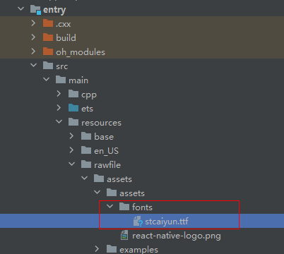

> 模板版本：v0.2.2

<p align="center">
  <h1 align="center"> <code>react-native-image-marker</code> </h1>
</p>
<p align="center">
    <a href="https://github.com/JimmyDaddy/react-native-image-marker">
        
    </a>
    <a href="https://github.com/JimmyDaddy/react-native-image-marker/blob/master/LICENSE">
        
    </a>
</p>


> [!TIP] [Github 地址](https://github.com/react-native-oh-library/react-native-image-marker)

请到三方库的 Releases 发布地址查看配套的版本信息：

| 三方库版本 | 发布信息                                                     | 支持RN版本 |
| ---------- | ------------------------------------------------------------ | ---------- |
| 1.2.6      | [@react-native-oh-tpl/react-native-image-marker Releases](https://github.com/react-native-oh-library/react-native-image-marker/releases) | 0.72       |
| 1.3.0      | [@react-native-ohos/react-native-image-marker Releases]()    | 0.77       |

对于未发布到npm的旧版本，请参考[安装指南](/zh-cn/tgz-usage.md)安装tgz包。

## 安装与使用

进入到工程目录并输入以下命令：


<!-- tabs:start -->

#### **npm**

```bash
# V0.72
npm install @react-native-oh-tpl/react-native-image-marker

# 0.77
npm install @react-native-ohos/react-native-image-marker
```

#### **yarn**

```bash
# 0.72
yarn add @react-native-oh-tpl/react-native-image-marker

# 0.77 
yarn add @react-native-ohos/react-native-image-marker
```

<!-- tabs:end -->

下面的代码展示了这个库的基本使用场景：

> [!WARNING] 使用时 import 的库名不变。

```tsx
import Marker, {
    Position, ImageMarkOptions,  TextMarkOptions
  } from 'react-native-image-marker'
import React, { useState } from "react";
import { StyleSheet, ScrollView, Text, View, Button, Image } from "react-native";
import { Colors } from 'react-native/Libraries/NewAppScreen';

export const ImageMarkerText = () => {
    const [texturl, setTextMarkUrl] = useState('');
    const [imageurl,setImageMarkUrl] = useState('');
    const text_options: TextMarkOptions = {
      backgroundImage: { src: 'https://developer.huawei.com/allianceCmsResource/resource/HUAWEI_Developer_VUE/images/yuekan/xintexing00.jpg' },
      watermarkTexts: [{
        text: 'hello world \n 你好',
        position: {
          position: Position.topLeft,
        },
        style: {
          color: '#FFFF00',
          fontSize: 30,
          fontName: 'Arial',
          rotate: 30,
          textBackgroundStyle: {
            padding: '10% 10%',
            color: '#02B96B',
          },
          shadowStyle: {
            dx: 10,
            dy: 10,
            radius: 10,
            color: '#008F6D',
          },
          strikeThrough: true,
          underline: true,
        },
      }, {
        text: 'hello world \n 你好',
        position: {
          position: Position.center,
        },
        style: {
          color: '#FFFF00',
          fontSize: 30,
          fontName: 'Arial',
          textBackgroundStyle: {
            padding: '10% 10%',
            color: '#0FFF00',
          },
          strikeThrough: true,
          underline: true,
        },
      }],
    }

    const image_options: ImageMarkOptions = {
      backgroundImage: { src: 'https://developer.huawei.com/allianceCmsResource/resource/HUAWEI_Developer_VUE/images/yuekan/xintexing00.jpg' },
      watermarkImages: [{
        src: 'https://developer.huawei.com/allianceCmsResource/resource/HUAWEI_Developer_VUE/images/yingyongicon.png',
        rotate:20,
        position: {
          position: Position.topLeft,
        },
      },
      {
        src: 'https://developer.huawei.com/allianceCmsResource/resource/HUAWEI_Developer_VUE/images/yingyongicon.png',
        rotate:50,
        position: {
          position: Position.bottomCenter,
        },
      }
    ],
    }

    const markText = () => {
      Marker.markText(text_options).then((result) => {
        setTextMarkUrl(result)
      }).catch(error => {
        console.log('error', error)
      })
    }
    
    const markImage = () => {
      Marker.markImage(image_options).then((result) => {
        setImageMarkUrl(result)
      }).catch(error => {
        console.log('error', error)
      })
    }
    return (
        <ScrollView style={{flex: 1}}>
          <View style={styles.body}>
              <View style={styles.sectionContainer}>
                <Text style={styles.sectionTitle}>
                  {"image marker"}
                </Text>
                <Button
                  title="Mark image "
                  color="#9a73ef"
                  onPress={markImage}
                />
                <Text style={styles.sectionTitle}>
                  {imageurl}
                </Text>
                <Image resizeMode='contain' source={{ uri: imageurl, width: 300, height: 300 }} />
              </View>
            </View>
            <View style={styles.body}>
              <View style={styles.sectionContainer}>
                <Text style={styles.sectionTitle}>
                  {"image marker"}
                </Text>
                <Button
                  title="mark text "
                  color="#9a73ef"
                  onPress={markText}
                />
                <Text style={styles.sectionTitle}>
                  {texturl}
                </Text>
                <Image resizeMode='contain' source={{ uri: texturl, width: 300, height: 300 }} />
              </View>
            </View>
      </ScrollView>
      );
  }
  const styles = StyleSheet.create({
    body: {
      backgroundColor: Colors.dark,
    },
    sectionContainer: {
      marginTop: 32,
      paddingHorizontal: 24,
    },
    sectionTitle: {
      marginBottom: 30,
      fontSize: 12,
      fontWeight: '600',
      color: Colors.white,
    }
  });
```

## 使用 Codegen

本库已经适配了 `Codegen` ，在使用前需要主动执行生成三方库桥接代码，详细请参考[ Codegen 使用文档](/zh-cn/codegen.md)。

## Link

目前 HarmonyOS 暂不支持 AutoLink，所以 Link 步骤需要手动配置。

首先需要使用 DevEco Studio 打开项目里的 HarmonyOS 工程 `harmony`

### 1.在工程根目录的 `oh-package.json` 添加 overrides 字段

```json
{
  ...
  "overrides": {
    "@rnoh/react-native-openharmony" : "./react_native_openharmony"
  }
}
```

### 2.引入原生端代码

目前有两种方法：

1. 通过 har 包引入（在 IDE 完善相关功能后该方法会被遗弃，目前首选此方法）；
2. 直接链接源码。

方法一：通过 har 包引入（推荐）

> [!TIP] har 包位于三方库安装路径的 `harmony` 文件夹下。

打开 `entry/oh-package.json5`，添加以下依赖

- 0.72

```json
"dependencies": {
    "@rnoh/react-native-openharmony": "file:../react_native_openharmony",
    "@react-native-oh-tpl/react-native-image-marker": "file:../../node_modules/@react-native-oh-tpl/react-native-image-marker/harmony/image_marker.har"
  }
```

- 0.77

```json
"dependencies": {
    "@rnoh/react-native-openharmony": "file:../react_native_openharmony",
    "@react-native-ohos/react-native-image-marker": "file:../../node_modules/@react-native-ohos/react-native-image-marker/harmony/image_marker.har"
  }
```

点击右上角的 `sync` 按钮

或者在终端执行：

```bash
cd entry
ohpm install
```

方法二：直接链接源码

> [!TIP] 如需使用直接链接源码，请参考[直接链接源码说明](/zh-cn/link-source-code.md)

### 3.在 ArkTs 侧引入 RNImageMarkerPackage

打开 `entry/src/main/ets/RNPackagesFactory.ts`，添加：

```diff
  ...
// 0.72
+ import {RNImageMarkerPackage} from '@react-native-oh-tpl/react-native-image-marker/ts';

// 0.77  
+ import {RNImageMarkerPackage} from '@react-native-ohos/react-native-image-marker/ts';

export function createRNPackages(ctx: RNPackageContext): RNPackage[] {
  return [
    new SamplePackage(ctx),
+    new RNImageMarkerPackage(ctx)
  ];
}
```

### 4.运行

点击右上角的 `sync` 按钮

或者在终端执行：

```bash
cd entry
ohpm install
```

然后编译、运行即可。

## 约束与限制

### 兼容性

本文档内容基于以下版本验证通过：

1. RNOH：0.72.33; SDK：OpenHarmony 5.0.0.71(API Version 12 Release); IDE：DevEco Studio 5.0.3.900; ROM：NEXT.0.0.71;
2. RNOH: 0.77.18; SDK: HarmonyOS 6.0.0 Release SDK; IDE: DevEco Studio  6.0.0.868; ROM: 6.0.0.112;

### 权限要求

如果用到了网络图片，需要在 entry 目录下的 module.json5 中添加网络信息权限

打开entry/src/main/module.json5，添加：

```js
...
"requestPermissions": [
    {
    "name": "ohos.permission.INTERNET"
    }
]
```
### 字体使用
如果需要使用字体，需要在entry的resources目录下的rawfile/assets/assets/fonts目录下存放使用的字体文件，
如下图：




##  API

> [!TIP] "Platform"列表示该属性在原三方库上支持的平台。

> [!TIP] "HarmonyOS Support"列为 yes 表示 HarmonyOS 平台支持该属性；no 则表示不支持；partially 表示部分支持。使用方法跨平台一致，效果对标 iOS 或 Android 的效果。

| Name    | 描述            | Type     | Required | Platform    | HarmonyOS Support |
| ------- | --------------- | -------- | -------- | ----------- | ----------------- |
| markImage   | 在背景图片上标记图标  | string | no  | Android/iOS | yes               |
| markText | 在背景图片上标记文字 | string | no   | Android/iOS | yes               |

##### ImageOptions

| Name        | 描述             | Type   | Required | Platform    | HarmonyOS Support |
| ----------- | ---------------- | ------ | -------- | ----------- | ----------------- |
| src  | 图片路径，本地图片 | string | yes      | iOS/Android | yes               |
| scale | 图片缩放比例 `>0`，默认值为1 | number | no      | iOS/Android | yes               |
| rotate | 图片旋转角度 `0-360`，默认值为0 | number | no      | iOS/Android | yes               |
| alpha | 图片透明度 `0-1`，默认值为1 | number | no      | iOS/Android | yes |

##### ImageFormat

| Name        | 描述             | Type   | Required | Platform    | HarmonyOS Support |
| ----------- | ---------------- | ------ | -------- | ----------- | ----------------- |
| png  | PNG格式图片 | string | no      | iOS/Android | yes               |
| jpg | JPG格式图片 | string | no      | iOS/Android | yes               |
| base64 | Base64格式图片 | string | no      | iOS/Android | yes               |
##### PositionOptions 

| Name        | 描述             | Type   | Required | Platform    | HarmonyOS Support |
| ----------- | ---------------- | ------ | -------- | ----------- | ----------------- |
| X  | 背景图片上的水平坐标 | number / string | no      | iOS/Android | yes |
| Y  | 背景图片上的垂直坐标 | number / string | no      | iOS/Android | yes |
| position  | 位置枚举 | [Position](#position) | no | iOS/Android | yes |

##### Position 

| Name        | 描述             | Type   | Required | Platform    | HarmonyOS Support |
| ----------- | ---------------- | ------ | -------- | ----------- | ----------------- |
| topLeft  | 背景图片左上角 |  string | no      | iOS/Android | yes |
| topCenter  | 背景图片顶部居中 | string | no      | iOS/Android | yes |
| topRight  | 背景图片右上角 | string | no | iOS/Android | yes |
| bottomLeft  | 背景图片左下角 | string | no | iOS/Android | yes |
| bottomCenter  | 背景图片底部居中 | string | no | iOS/Android | yes |
| bottomRight  | 背景图片右下角 | string | no | iOS/Android | yes |
| center  | 背景图片中心 | string | no | iOS/Android | yes |
#### markImage
```js
markImage(options: ImageMarkOptions): Promise<string>;
```
##### ImageMarkOptions

| Name        | 描述             | Type   | Required | Platform    | HarmonyOS Support |
| ----------- | ---------------- | ------ | -------- | ----------- | ----------------- |
| backgroundImage  | 背景图片选项 | [ImageOptions](#imageoptions) | yes      | iOS/Android | partially               |
| quality | 图片质量 `0-100`，`100` 为最佳质量，默认值为100 | number | no      | iOS/Android | yes               |
| filename | 保存的图片名称 | string | no      | iOS/Android | yes               |
| saveFormat | 保存的图片格式 'png','jpg','base64'，默认为'png' | [ImageFormat](#imageformat) | no      | iOS/Android | yes               |
| watermarkImages | 水印图片数组 | Array\<[WatermarkImageOptions](#watermarkimageoptions)> | yes      | iOS/Android | yes  |


##### WatermarkImageOptions 

| Name        | 描述             | Type   | Required | Platform    | HarmonyOS Support |
| ----------- | ---------------- | ------ | -------- | ----------- | ----------------- |
| src  | 图片路径，本地图片 | string | yes      | iOS/Android | yes               |
| scale | 图片缩放比例 `>0`，默认值为1 | number | no      | iOS/Android | yes               |
| rotate | 图片旋转角度 `0-360`，默认值为0 | number | no      | iOS/Android | yes               |
| alpha | 图片透明度 `0-1`，默认值为1 | number | no      | iOS/Android | yes |
| position  | 图标在背景图片上的位置 | [PositionOptions](#positionoptions) | no      | iOS/Android | yes               |


#### markText

```json
markText(options: TextMarkOptions): Promise<string>;
```
##### TextMarkOptions
| Name      | 描述                                    | Type   | Required | Platform    | HarmonyOS Support |
| --------- | --------------------------------------- | ------ | -------- | ----------- | ----------------- |
| backgroundImage | 背景图片选项 | [ImageOptions](#imageoptions) | yes      | iOS/Android | partially                |
| watermarkTexts      | 文字选项      | Array\<[TextOptions](#textoptions)> | yes      | iOS/Android | yes               |
| quality      | 图片质量 0-100，100 为最佳质量，默认值为100 | number | no      | iOS/Android | yes               |
| filename      | 保存的图片名称          | string | no      | iOS/Android | yes               |
| saveFormat      | 保存的图片格式 'png','jpg','base64'，默认为'png'           | [ImageFormat](#imageformat) | no      | iOS/Android | yes               |

##### TextOptions
| Name      | 描述                                    | Type   | Required | Platform    | HarmonyOS Support |
| --------- | --------------------------------------- | ------ | -------- | ----------- | ----------------- |
| text | 文本内容 | string | yes      | iOS/Android | yes               |
| position      | 文字位置选项 | [PositionOptions](#positionoptions) | no      | iOS/Android | yes               |
| style      | 文字样式         | [TextStyle](#textstyle) | no      | iOS/Android | yes               |

##### TextStyle

| Name      | 描述                                    | Type   | Required | Platform    | HarmonyOS Support |
| --------- | --------------------------------------- | ------ | -------- | ----------- | ----------------- |
| color | 字体颜色 | string | yes      | iOS/Android | yes               |
| fontName      | 字体名称 | string | no      | iOS/Android | yes            |
| fontSize      | 字体大小        | number | no      | iOS/Android | yes               |
| shadowStyle | 文字阴影样式 | [ShadowLayerStyle](#shadowlayerstyle) | no      | iOS/Android | yes               |
| textBackgroundStyle      | 文字背景样式 | [TextBackgroundStyle](#textbackgroundstyle)  | no      | iOS/Android | yes               |
| underline      | 文字下划线样式        | boolean | no      | iOS/Android | yes               |
| skewX | CSS斜体角度，可以用italic替代 | number | no      | iOS/Android | yes         |
| strikeThrough      | 文字删除线 | boolean | no      | iOS/Android | yes               |
| textAlign      | 文字对齐方式 'left' / 'center' / 'right'       | string | no      | iOS/Android | yes               |
| italic | 文字斜体 | boolean | no      | iOS/Android | yes            |
| bold      | 文字粗体 | boolean | no      | iOS/Android | yes               |
| rotate      | 文字旋转角度       | number | no      | iOS/Android | yes               |

##### ShadowLayerStyle

| Name      | 描述                                    | Type   | Required | Platform    | HarmonyOS Support |
| --------- | --------------------------------------- | ------ | -------- | ----------- | ----------------- |
| dx      | 阴影X轴偏移量       | number | yes      | iOS/Android | yes               |
| dy      | 阴影Y轴偏移量     | number | yes      | iOS/Android | yes               |
| radius      | 阴影半径      | number | yes      | iOS/Android | yes               |
| color      | 阴影颜色       | string | yes      | iOS/Android | yes               |

##### TextBackgroundStyle
extends Padding
| Name      | 描述                                    | Type   | Required | Platform    | HarmonyOS Support |
| --------- | --------------------------------------- | ------ | -------- | ----------- | ----------------- |
| type      | 背景类型，TextBackgroundType枚举      | [TextBackgroundType](#textbackgroundtype) | no      | iOS/Android | yes               |
| color      | 背景颜色    | string | yes      | iOS/Android | yes               |
| cornerRadius      | 背景圆角半径     | [CornerRadius](#cornerradius) | no      | iOS/Android | yes               |
| padding      | 文字背景内边距，最多四个值，空格分隔   | number / string | no      | iOS/Android | yes               |
| paddingLeft      | 文字背景左内边距  | number / string | no      | iOS/Android | yes               |
| paddingRight      | 文字背景右内边距    | number / string | no      | iOS/Android | yes               |
| paddingTop      | 文字背景上内边距    | number / string | no      | iOS/Android | yes               |
| paddingBottom      | 文字背景下内边距   | number / string  | no      | iOS/Android | yes               |
| paddingHorizontal      | 文字背景水平内边距（左右）    | number / string | no      | iOS/Android | yes               |
| paddingVertical      | 文字背景垂直内边距（上下）    | number / string | no      | iOS/Android | yes               |
| paddingX      | 文字背景X轴内边距，paddingHorizontal的别名    | number / string | no      | iOS/Android | yes               |
| paddingY      | 文字背景Y轴内边距，paddingVertical的别名  | number / string | no      | iOS/Android | yes               |

##### TextBackgroundType

| Name      | 描述                                    | Type   | Required | Platform    | HarmonyOS Support |
| --------- | --------------------------------------- | ------ | -------- | ----------- | ----------------- |
| stretchX      | X轴拉伸背景类型     | string | no      | iOS/Android | yes               |
| stretchY      | Y轴拉伸背景类型   | string | no      | iOS/Android | yes               |
| none      | 自适应背景类型    | string | no      | iOS/Android | yes               |


##### CornerRadius

| Name      | 描述                                    | Type   | Required | Platform    | HarmonyOS Support |
| --------- | --------------------------------------- | ------ | -------- | ----------- | ----------------- |
| topLeft      | 左上角圆角半径     | [RadiusValue](#radiusvalue) | no      | iOS/Android | yes               |
| topRight      | 右上角圆角半径   | [RadiusValue](#radiusvalue) | no      | iOS/Android | yes               |
| bottomLeft      | 左下角圆角半径  | [RadiusValue](#radiusvalue) | no      | iOS/Android | yes               |
| bottomRight      | 右下角圆角半径   | [RadiusValue](#radiusvalue) | no      | iOS/Android | yes               |
| all      | 所有角圆角半径    | [RadiusValue](#radiusvalue) | no      | iOS/Android | yes               |

##### RadiusValue

| Name      | 描述                                    | Type   | Required | Platform    | HarmonyOS Support |
| --------- | --------------------------------------- | ------ | -------- | ----------- | ----------------- |
| x      | X轴圆角值     | number / string | no      | iOS/Android | yes               |
| y      | Y轴圆角值  | number / string  | no      | iOS/Android | yes               |

## 遗留问题
- [ ] Harmony OS is not support backgroundImage-ImageOptions-alpha feature now: [issue#30](https://github.com/react-native-oh-library/react-native-image-marker/issues/30)
- [x] Harmony OS is not support font name feature now: [issue#7](https://github.com/react-native-oh-library/react-native-image-marker/issues/7) 
- [x] Harmony OS is not support font skewX feature  now: [issue#8](https://github.com/react-native-oh-library/react-native-image-marker/issues/8)
- [x] Harmony OS is not support font italic feature now: [issue#9](https://github.com/react-native-oh-library/react-native-image-marker/issues/9)

## 其他

## 开源协议

本项目基于[The MIT License(MIT)](https://github.com/JimmyDaddy/react-native-image-marker/blob/master/LICENSE) ，请自由地享受和参与开源。


